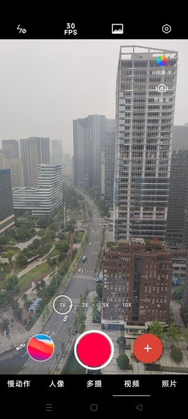
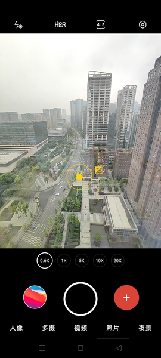

CameraUnit Demo App
=====

简体中文 | [English](./README.md) 




## 关于能力开放

[能力开放(CameraUnit)][CameraUnitLink] 是 OPPO 影像能力开放接口，可消除系统影像能力与三方应用间的隔阂，
用户在三方应用中也能获得与 OPPO 相机一致的拍摄体验。提供了一种轻量、快捷、高效的接入 ColorOS 系统影像功能的途径。

这个项目提供了一种接入能力开放 (CameraUnit SDK) 的解决方案，接入文档详见 [配置和初始化说明][CameraUnitInstructions]。
在使用该 SDK 时，你可以参照本项目的调用逻辑。

目前为止，本项目接入了以下功能（视不同机型的支持情况而定）：

| 视频功能                | 拍照功能                  | 仅预览功能                    |
| :----:                 | :----:                   | :----:                      |
| 视频防抖                | 超广角拍照                 | 多摄同开 (前置 & 后置)        |
| 超级视频防抖             | 人像拍照                  |                             |
| 超级视频防抖 PRO         | 夜景拍照                  |                             |
| AI 夜景视频              | HDR 拍照                 |                             |
| 视频 HDR                | 拍照变焦组合               |                             |
| 慢动作视频               |                          |                             |
| 视频变焦组合             |                          |                             |
| 高帧率录像               |                          |                             |
| 1080P 视频              |                          |                             |

Supported devices:

| A 系列             | F 系列              | R 系列               | 其他系列            |
| :----:             | :----:             | :----:              | :----:              |
| OPPO A93           | OPPO Find X2       | OPPO Reno2 Z        | OPPO F17 Pro        |
| OPPO A94           | OPPO Find X2 Lite  | OPPO Reno 3         | OPPO F19 Pro        |
| OPPO A95           | OPPO Find X2 Pro   | OPPO Reno Ace2      |                     |
|                    | OPPO Find X3       | OPPO Reno4          |                     |
|                    | OPPO Find X3 Pro   | OPPO Reno5          |                     |
|                    | OPPO Find X3 Neo   | OPPO Reno6          |                     |

## 关于 CameraUnit Demo App
目前，我们提供了一个示例程序来展示 CameraUnit SDK 接口的调用方法，你也可以在你的项目中直接依赖 `camerax module` 来完成相应的业务逻辑。

## 状态
目前，1.0.0 版本的示例程序已经发布并且稳定，我们会定期持续发布版本来集成新功能或者解决一些稳定性问题。
非常欢迎您也可以参与到本项目中，Comments/Bugs/Questions/PR 都是受欢迎的。
如果您想要贡献您的代码，请仔细阅读 [CONTRIBUTING.md][contributing] 中的内容。

## API 更新记录
详官网[版本更新说明][updateLog] 。

## 编译
本项目使用 gradle 构建起来非常的简单：

```shell
git clone git@github.com:oppo/CameraUnit.git
cd CameraUnit
./gradlew :app:assembleRelease
```

**注意：**: 确保您本地 *Android SDK* 和 *Android Support Repository* 已经安装, `$ANDROID_HOME` 的环境变量已经配置
或者配置 `sdk.dir=...` 即 SDK 的路径到项目根目录的 `local.properties` 文件中。

## 开发
根据 [编译](#编译) 中的步骤配置项目，并按照您的需求来修改对应的文件。推荐使用[Android Studio][android-studio] 便捷的导入整个项目。

使用 Android Studio 导入项目的步骤如下:

1. 打开Android Studio，并点击 *文件* 菜单或者 *欢迎页面*;
2. 点击 *打开...*。
3. 找到 CameraUnit 根目录。
4. 选择 `setting.gradle` 文件，完成导入。

## 问题 & 获取帮助
如需要报告问题或者提出功能需求，请[在Github中打开一个新问题][open-new-issue]。
如有合作意向、疑问、建议或者其他任何问题，欢迎[给项目组发邮件][discussion]。

在打开一个新问题之前，请您务必仔细阅读 [问题报告清单][issue-reporting-guidelines]
如果问题未按照推荐的方式提报，可能会被当作无效问题关闭。

## Contribution
在您需要提交 Pull Request 到本项目之前，请您务必仔细阅读 [CONTRIBUTING.md][contributing]。
更多详细信息请参考 [Contributing docs page][contributing-page].

感谢所有为这个项目做出贡献的开发者!

## Thanks
* 感谢 Airbnb lottie 项目团队及 [lottie](https://github.com/airbnb/lottie).
* 感谢 FloatingActionButton 项目团队及 [FloatingActionButton](https://github.com/Clans/FloatingActionButton).
* 感谢 CircleImageView 项目团队及 [CircleImageView](https://github.com/hdodenhof/CircleImageView).
* 感谢 Glide 项目团队及 [glide](https://github.com/bumptech/glide).
* 感谢 PermissionsDispatcher 项目团队及 [PermissionsDispatcher](https://github.com/permissions-dispatcher/PermissionsDispatcher).
* 再次感谢所有为这个项目做出贡献的开发者!

## 作者
@LiuCun at oppo, [@JianGuo Yang](https://github.com/lgyjg) at oppo.

## License
[Apache License 2.0][license]

Copyright (c) 2021 OPPO. All rights reserved.

[CameraUnitLink]: https://open.oppomobile.com/new/developmentDoc/info?id=10717
[CameraUnitInstructions]: https://open.oppomobile.com/new/developmentDoc/info?id=10723
[updateLog]: https://open.oppomobile.com/new/developmentDoc/info?id=11163
[issue-reporting-guidelines]: #
[open-new-issue]: https://github.com/oppo/CameraUnit/issues
[android-studio]: https://developer.android.com/studio
[contributing-page]: https://github.com/oppo/CameraUnit/blob/main/CONTRIBUTING.md
[discussion]: https://github.com/oppo/CameraUnit/issues
[contributing]: https://github.com/oppo/CameraUnit/blob/main/CONTRIBUTING.md
[license]: https://www.apache.org/licenses/LICENSE-2.0
